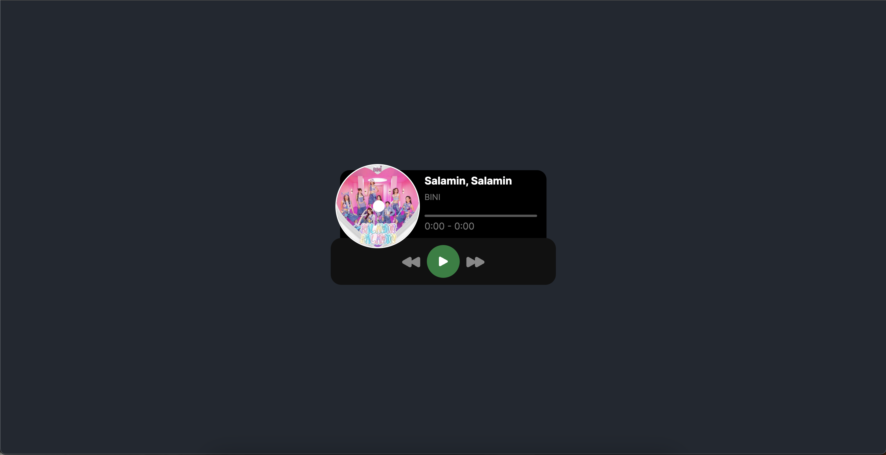

# Mini Player App

An application used to add, view, edit and delete items in your menu, built with React, Redux Toolkit, JavaScript, Formik with Yup, TailwindCSS with Flowbite for React.

## Project Screen Shot

## Installation and Setup Instructions

Clone down this repository. You will need `node` and `npm` installed globally on your machine.

Installation:

`npm install`

To Start Server:

`npm start`

To Visit App:

`localhost:3000/`

## Important 3rd Party libraries used

- NextJS (https://nextjs.org/)

- Tailwind (https://tailwindcss.com/)

## Roadmap

- Seek functionality
- Display lyrics
- Upload own mp3
- Repeat and Shuffle
